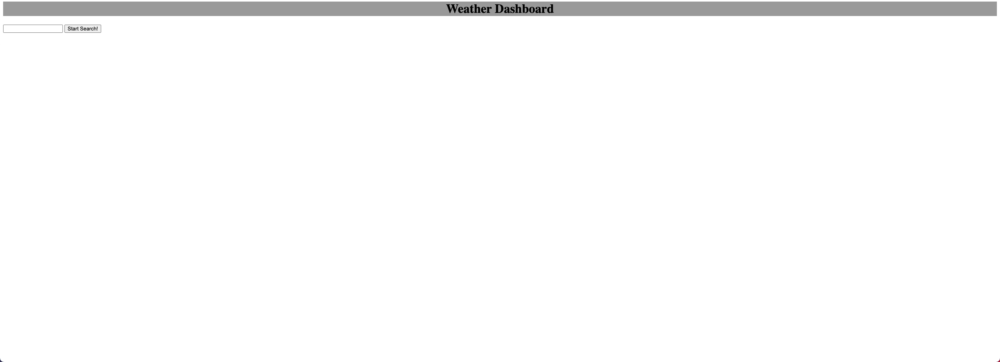
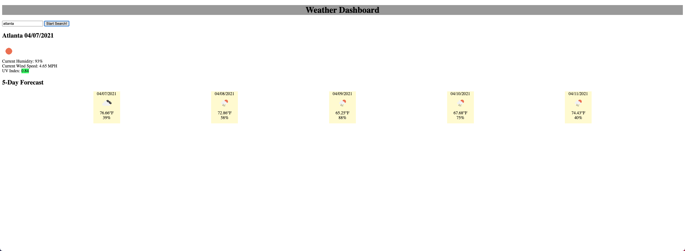

# Homework-6

## Project Overview

This is my homework #6 Weather-Dashboard.

Objective from this week's homework was to use third-party APIs to access their data and functionality by making requests with specific parameters to a URL. Using this technique I was tasked with building a weather dashboard web application using HTML, CSS, and Javascript.

My logic behind this week's homework was to build a skeleton of the web application using HTML, and CSS changes to the <Div's> when the serach button was clicked. In my CSS, I displayed: none to not have CSS show in the beginning. When the search button was clicked, I made sure it was displayed using .addeventlistener API.

1. I declared three variables on top of my JS file called "apikey", "inputIdJs", "buttonIdJs" to use in rest of my code.
2. Throughout my code in JS, I have two functions called "getUvIndex", "getFiveDays", and an eventlistener function attached on "buttonIdJs" I declared on top.
3. When eventlistener on buttonIdJs is pushed it pulls the current data and city from the city that user searched and it displays on bottom of the search button. I also added an if, else if, else statement that if the uv index number is less than 2, it will display green. If it's between 3 - 7 it will display orange, and if it's greater than 7, it will display in red.
4. Furthermore, for five days forecast, I had to use a different(?) set of API; however, used same apikey for it. To get five days, I used a for loop to get five days. Originally the API gave me a weather update for the next 7 days, but I only used five days forecast.

Attached is my screenshot of my workday scheduler.

## Attached is also a personal link to my homework assignment #6

## https://jung0808.github.io/homework-6-weather-dashboard/

## https://github.com/jung0808/homework-6-weather-dashboard/
